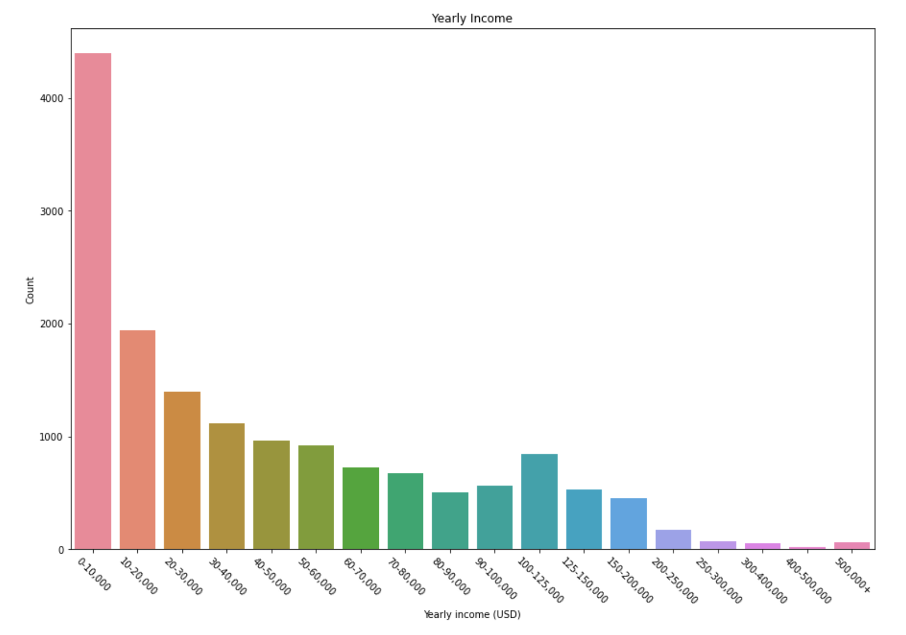
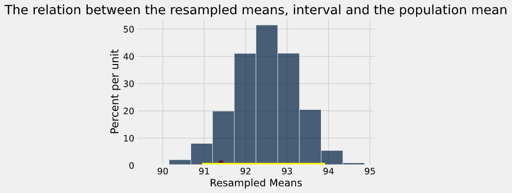
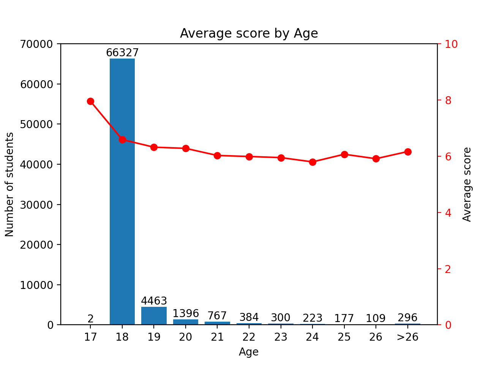
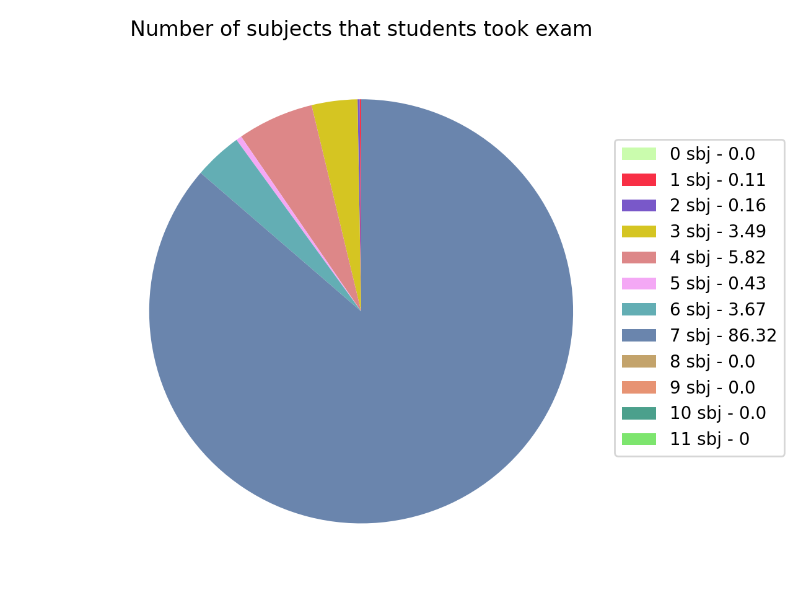

---

### Projects 

# [1. HIV Estimated Prevalence](https://github.com/minuptt/HIV_Estimated_Prevalence)

* Discovering and analyzing about HIV estimated prevalence of people ages from 15 to 49 in the world from 1979 to 2011

# [2. Gender Pay Gap Salary Prediction](/https://github.com/minuptt/Gender_Pay_Salary_Prediction)

* Cleaning data
* Take random 500 samples / 5000 sample to analyze the income gap between female and male employees.
* Draw charts that show the relationships of them.
* Define confidence interval and P-value to validate the hypothesis

# [3. Restaurant Inspection Scores in Austin, Texas](https://github.com/minuptt/Restaurant_Inspection_Scores)

* In this project, we will explore a dataset that includes the safety scores for restaurants in the city of Austin, Texas. 
* We will be interested in determining the average score for the city from a random sample of the scores; the average restaurant score in out of 100. 
* We'll compare 2 method for computing a confidence interval for that quantity: the bootstrap resampling method and an approximation based on the Central Limit Theorem.

---

### Category Name 2

- [HCM City 2020 High School Graduation Exam Scores](https://github.com/minuptt/HCMC_Scores_2020)

- [Project 2 Title](http://example.com/)
- [Project 3 Title](http://example.com/)
- [Project 4 Title](http://example.com/)
- [Project 5 Title](http://example.com/)

---

---

